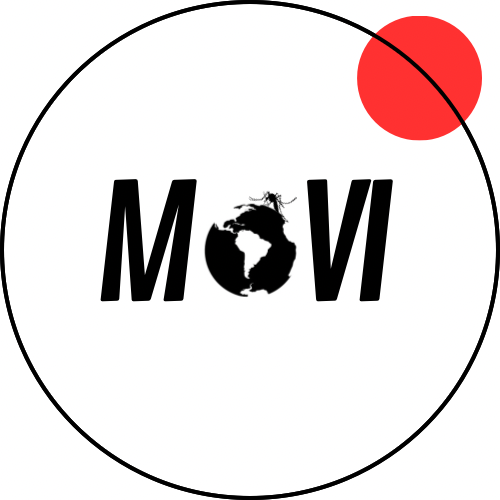

<!-- README.md is generated from README.Rmd. Please edit that file. -->
<!-- The code to render this README is stored in .github/workflows/render-readme.yaml -->
<!-- Variables marked with double curly braces will be transformed beforehand: -->
<!-- `packagename` is extracted from the DESCRIPTION file -->
<!-- `gh_repo` is extracted via a special environment variable in GitHub Actions -->

# MoVI 

<!-- badges: start -->

[](https://opensource.org/license/mit/)
[](https://github.com/biomac-lab/movi/actions/workflows/R-CMD-check.yaml)
[](https://app.codecov.io/gh/biomac-lab/movi?branch=main)
[](https://www.reconverse.org/lifecycle.html#concept)
<!-- badges: end -->

MoVI provides functions to estimate and visualize the Lancet Countdown South America's Mosquito-borne diseases Vulnerability Indicator estimated from the:

- [Climate-driven Mosquito-borne Viral Suitability Estimator][1]
- [World Bank Climate Change Knowledge Portal][2]
- [Proportion of the urban population without safely managed drinking water][3]
- [Proportion of population living below 2000 meters above sea level][4]
- [Healthcare Access and Quality Index][5]

Data is available for: Argentina, Bolivarian Republic of Venezuela, Bolivia, Brazil, Chile, Colombia, Costa Rica, Ecuador, El Salvador, Guatemala, Honduras, Mexico, Nicaragua, Panama, Paraguay, Peru, Uruguay

References

[1]: https://doi.org/10.1111/2041-210X.13205

[2]: https://climateknowledgeportal.worldbank.org/

[3]: https://washdata.org/

[4]: https://doi.org/10.1073/pnas.2102463118

[5]: https://ghdx.healthdata.org/gbd-2019

<!-- This sentence is optional and can be removed -->

MoVI is developed at the [BIOMAC](https://ingbiomedica.uniandes.edu.co/es/investigacion/lineas-investigacion/biologia-matematica-computacional) at the [Universidad de los Andes](https://uniandes.edu.co/).

## Installation

You can install the development version of packagetemplate from
[GitHub](https://github.com/) with:

``` r
# install.packages("pak")
pak::pak("biomac-lab/movi")
```

## Example

These examples illustrate some of the current functionalities

## Development

### Lifecycle

This package is currently a *concept*, as defined by the [RECON software
lifecycle](https://www.reconverse.org/lifecycle.html). This means that
essential features and mechanisms are still being developed, and the
package is not ready for use outside of the development team.

### Contributions

Contributions are welcome via [pull
requests](https://github.com/biomac-lab/movi/pulls).

### Code of Conduct

Please note that the packagetemplate project is released with a
[Contributor Code of
Conduct](https://github.com/epiverse-trace/.github/blob/main/CODE_OF_CONDUCT.md).
By contributing to this project, you agree to abide by its terms.
